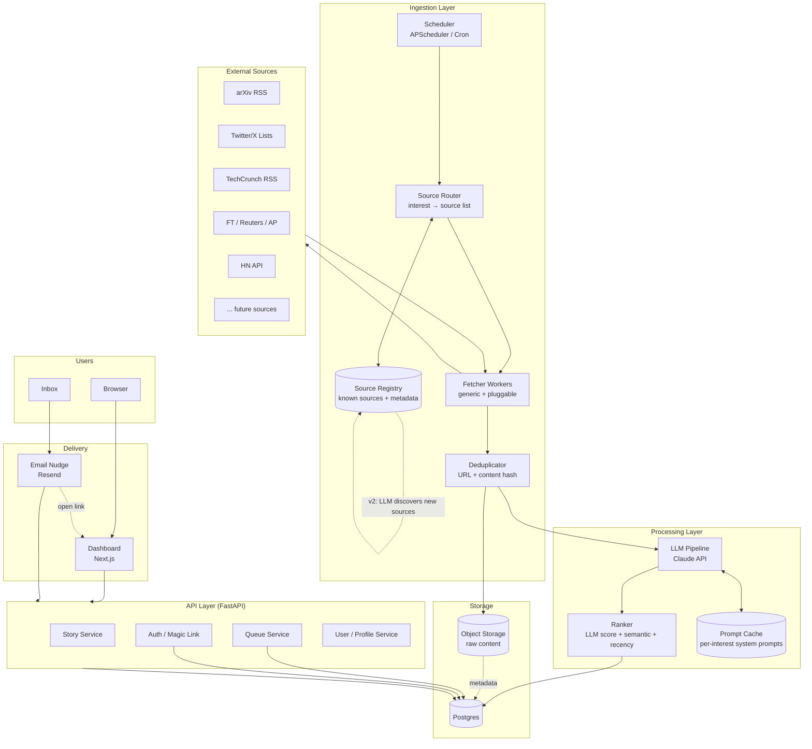

# 🏗️ System Architecture — Signal Engine (Phase 2)

## 1. Overview

Multi-user, multi-domain signal engine. Continuous ingestion → LLM processing → per-user rolling queue. Dashboard + email nudge delivery.

---

## 2. High-Level Architecture



---

## 3. Component Breakdown

### 3.1 Ingestion Layer

| Component | Responsibility |
|---|---|
| **Scheduler** | Trigger ingestion cycle per interest on schedule |
| **Source Router** | Maps interest → list of sources to fetch. V1: deterministic (category → hardcoded list). V2+: dynamic (LLM/embedding matches interest description → source registry) |
| **Source Registry** | DB table of known sources: URL, type, fetch method, tags, authority weight. Hand-curated in V1. LLM-expandable in V2+ |
| **Fetcher Workers** | Generic fetcher — takes a source config, pulls content, normalizes to `Story` schema. Source-type adapters: `RSS`, `API`, `Scraper` |
| **Deduplicator** | Hash by URL + title + content-fingerprint. Reject before LLM call (cost saving) |

**Source Registry schema:**
```sql
sources (
  id, name, url, fetch_type,   -- fetch_type: rss | api | scraper
  tags[],                       -- e.g. ["ai_ml", "research", "arxiv"]
  authority_weight float,        -- 0–1, hand-tuned
  fetch_interval_mins int,
  active bool
)
```

**Source Router — V1 vs V2+:**

| Version | Behavior |
|---|---|
| **V1 (now)** | Category → hardcoded source tag filter. `AI/ML` → `WHERE 'ai_ml' = ANY(tags)` |
| **V2 (free-form)** | Interest description → embedding → cosine similarity vs source tag embeddings → ranked source list |
| **V3 (discovery)** | LLM proposes new sources for unmatched interests → human review → added to registry |

This abstraction means fetchers never change — only the router logic evolves.

**Common Story schema:**
```python
{
  "source_id": "arxiv",
  "external_id": "2401.12345",
  "url": "https://arxiv.org/abs/...",
  "title": "...",
  "raw_content": "...",
  "published_at": "2026-04-20T...",
  "domain": "ai_ml",
  "fetched_at": "..."
}
```

### 3.2 Processing Layer

**LLM Pipeline** — per story, generate:
- `summary` (2–3 lines)
- `why_matters` (domain-contextual)
- `action` (actionable takeaway)
- `relevance_score` (0–1)
- `relevance_tier` (High / Medium / Ignore)

Uses Claude with **prompt caching** per domain system prompt → cache hits on thousands of stories/day per domain.

**Ranker** — final score combines:
- LLM relevance score (primary)
- Keyword match against user interests (boost)
- Recency decay (last 30 days only, newer = higher)
- Source authority weight (editable per domain)

Rejected stories (`Ignore` tier) dropped, never enter queue pool.

### 3.3 Storage

**Postgres schema (core tables):**

```sql
users (id, email, created_at, digest_frequency)
user_interests (user_id, domain)  -- many-to-many
stories (id, source_id, url, title, published_at, domain,
         summary, why_matters, action, relevance_score, relevance_tier)
user_story_state (user_id, story_id, state, updated_at)
  -- state: queued | read | skipped | saved
magic_link_tokens (token, user_id, expires_at)
```

**Object Storage** — raw fetched content (HTML/text). Cheap, audit trail, reprocess if prompts change.

### 3.4 API Layer (FastAPI)

Endpoints:
- `POST /auth/magic-link` — request login email
- `GET /auth/verify?token=...` — verify + issue session
- `GET /queue` — top 5 unread stories for user (domain filter optional)
- `POST /stories/:id/read` — mark read
- `POST /stories/:id/skip` — mark skipped
- `POST /stories/:id/save` — save for later
- `GET /stories/saved` — saved list
- `GET /stories/history` — past read/skipped
- `GET /me/interests` / `PUT /me/interests` — domain selection

**Queue Service logic:**
```
SELECT stories ranked by score
WHERE domain IN user.interests
  AND published_at >= now() - 30 days
  AND story_id NOT IN (user's read/skipped/saved)
LIMIT 5
```

### 3.5 Delivery

**Dashboard (Next.js):**
- Queue view (5 cards, action buttons)
- Domain tabs
- Saved / History / Settings pages
- Server-side session via cookie

**Email Nudge (Resend):**
- Triggered by scheduler per user frequency
- "You have N new stories in your queue" + top 1–2 teasers + CTA link
- NOT full digest — drives users back to dashboard

---

## 4. Data Flow

### 4.1 Ingestion Flow (background)
```
Scheduler fires
  → Source Router resolves: active interests → source list (from Registry)
  → Fetcher pulls items from each source
  → Normalize to Story schema
  → Dedupe check against Postgres
  → New items stored (raw in Blob, metadata in PG)
  → Enqueue for LLM processing
  → LLM generates summary/why/action + score
  → Update story row with processed fields
  → Available in queue pool
```

> V2+: Router step becomes — interest description → embedding match → ranked sources from Registry → same fetch pipeline from there.

### 4.2 User Queue Flow (on-demand)
```
User opens dashboard
  → GET /queue
  → Query: unread stories × user.interests × 30-day window
  → Rank by score
  → Return top 5
  → User clicks Read/Skip/Save
  → Update user_story_state
  → Next GET /queue surfaces next-best
```

### 4.3 Email Nudge Flow
```
Scheduler per-user frequency fires
  → Count new unread stories since last nudge
  → If >= threshold → send email via Resend
  → Email links to dashboard (auto-login token)
```

---

## 5. Tech Stack Summary

| Layer | Tech |
|---|---|
| Backend | Python 3.11, FastAPI |
| Scheduler | APScheduler (in-process) → migrate to Celery/Redis if scale demands |
| DB | Postgres 15 |
| Object Storage | S3-compatible (local MinIO in dev) |
| LLM | Claude (claude-sonnet-4-6) via Anthropic SDK, prompt caching enabled |
| Frontend | Next.js 14, React, TailwindCSS |
| Email | Resend |
| Auth | Magic link (JWT session cookies) |
| Deployment | Docker Compose (dev), Fly.io / Railway (prod) |

---

## 6. Scaling Considerations (Phase 2 → Phase 3)

- **Ingestion**: move fetchers to Celery workers if >10 domains or >1K stories/day
- **LLM cost**: prompt caching critical — group stories by domain, reuse system prompt
- **Queue query**: add index on `(user_id, state, story_id)` + materialized view if slow
- **Multi-region**: not in Phase 2 scope

---

## 7. Open Questions

- Twitter/X API access — official API expensive; scrape vs paid tier TBD
- Source authority weights — hand-tuned or learned from user skip/read signal?
- Content licensing — can we store/summarize paywalled sources (FT, WSJ)? Legal review needed before launch
- Nudge frequency defaults — daily vs weekly by domain type?
